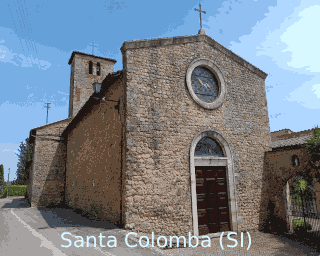

# Vampintervallo
Vampintervallo is a demo/slideshow designed for Amiga Vampire accelerator cards and V4SA products.

This project is a tribute to the beloved "Intervallo RAI," which used to air on Italian national TV channels in the '70s and '80s as a filler between shows.
The RAI Intervallo was simply a slideshow showcasing various Italian landscapes and architectural beauties, often unknown to the general public.
These images were accompanied by stunning background music, including:

- Passacaglia in G minor from Suite for Harpsichord No. 7, HWV 432 by Georg Friedrich Händel
- Sarabande from the Fourth Concert of the Concerts royaux by François Couperin
- Toccata from Sonata No. 6 in A Major from The Sonatas for Harpsichord by Pietro Domenico Paradisi
- Largo from the opera Serse (transcription for strings, harpsichord, and harp) by Georg Friedrich Händel
- Träumerei (transcription for strings and harp) by Robert Schumann
- Moment Musical No. 3 (transcription for strings) by Franz Schubert
- Bist du bei Mir (transcription for strings, harp, and organ) by Johann Sebastian Bach


Some examples of the "Intervallo RAI":
  - [https://www.youtube.com/watch?v=jqABIr0tIpw](https://www.youtube.com/watch?v=mKiDANvIl8o)
  - [https://www.youtube.com/watch?v=mKiDANvIl8o&list=PLtUEW3BEsRQSGwduuGlWty1xlOUZkMcKn](https://www.youtube.com/watch?v=_ACoU8fRyEw)
  - [https://www.youtube.com/watch?v=7Fp3FSOK3As&list=PLtUEW3BEsRQSGwduuGlWty1xlOUZkMcKn&index=10](https://www.youtube.com/watch?v=jcYEOgxe8RM)

In Vampintervallo, you will find just "Passacaglia" and "Toccata," which are my personal favorites. The pictures were taken with my smartphone and converted to 320x256x32 color format for the OCS/ECS chipset.

You are welcome to contribute by adding your own pictures to this repository. Just send a pull request, and I will be happy to include them in this project.

### Technical Information
This demo utilizes AMMX Vampire instructions, so it won't work on regular Amigas. It has been successfully tested on a V600 (core 2.17) and V4SA.
All assets (images and music) are embedded into a single executable, so to launch the demo, just double-click on it or run it from the CLI.
Images are stored in chunky format but converted on the fly in planar (see vampire C2P instruction), this allows v2 users to display the demo on a CRT monitor using the old analog db23 connector.

### Screenshots





### How to add a new image
- Store your image (and all output images that we are going to do into images subfolder)
- Load image into GIMP (or your favourite image editor)
- Resize image to 320X256
- Set color depth to 32
- Export setting output to raw RGB
- Export setting output to PNG
- Check final size is of raw image is 81920 bytes
- extract copperlist with extract_palette.py python script which is under pytools directory, example python3 extract_palette.py /mnt/ramdisk/Arena-XE3F2406a.png > /mnt/ramdisk/Arena-XE3F2406a.col
- copy Arena-XE3F2406a.col into images subfolder and include both color file and image file in the intervallo.s file (see IMAGES: label)

  Keep in mind to add pictures which are coherent with the intervallo, do not add images with recognizable people.

### How to Compile
In order to get the executable you must use vasm (http://sun.hasenbraten.de/vasm/) at least version 19f.
Optionally use shrinkler if you want to compress final executable which is quite big since the whole aiff music file is buried into the executable.
Compilation commands:
```
git clone --recurse-submodules https://github.com/Ozzyboshi/vampintervallo
vasmm68k_mot -DVAMPIRE -Fhunkexe -devpac -nocase -m68080 -DVAMPIRE  -o ./intervallo ./intervallo.s
```
